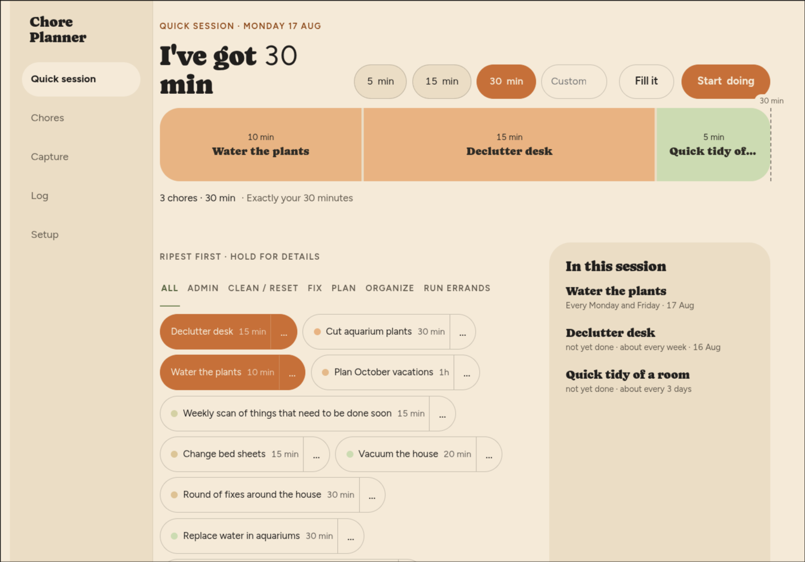
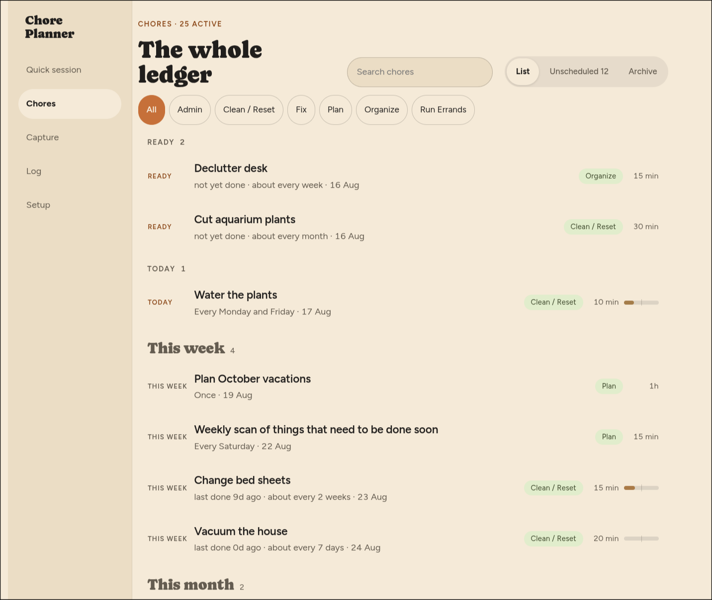
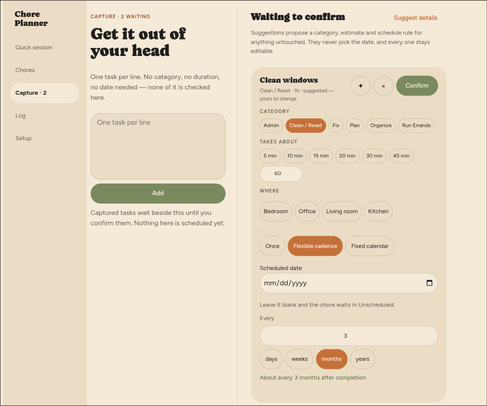

# Chore Planner

Chore Planner helps you turn the time you have into a realistic, focused set of
household chores and administrative tasks. Add what needs doing, decide how much
time you have, and let the app build a practical work session around it.

## The screens

### Quick session

Say how long you have, then pick chores from the pool. **Fill it** proposes the
rest of the session around whatever you have already picked, and never removes
anything you chose. Going over the budget is a plain readout, not an error.

### The whole ledger

Every chore, grouped by how soon it comes round with Ready at the top. Nothing
here is called late: a rhythm is measured from your own last completion, so a row
states a useful fact — `last done 9d ago · about every 2 weeks` — and leaves the
judgement out. The small bar reads how far through its cadence a chore is, and
stops at two cadences rather than counting upwards forever.

### Capture

Chores land here first, one per line, with nothing else required. Details can be
suggested for anything untouched, but a draft only leaves Capture when you
confirm it, and every suggested field stays yours to change.

## What it does

- Capture chores and admin tasks individually or in batches.
- Assign categories and location tags, then plan scheduled dates with one-off,
  periodic, or fixed-calendar rules.
- Build focused task bundles that fit a chosen time budget.
- Track work through a timer-based session, review what was completed, and keep a
  history of previous sessions.
- After configuring your own LLM keys in freezr and granting the app AI access,
  optionally use AI to suggest task details such as category, duration, and
  scheduling—always subject to user review.

## Built on freezr

Chore Planner (`pro.ginko.houseChores`) is a front-end-only
[freezr](https://freezr.info) app. It uses the freezr platform for storage and
app APIs while keeping the application itself as a portable bundle of HTML, CSS,
and JavaScript.

To learn more about the platform or contribute to it, visit the
[freezr repository on GitHub](https://github.com/salmanff/freezr).
